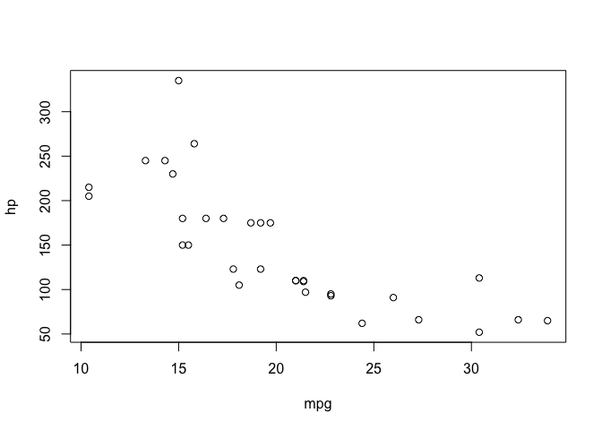

hw01\_dataset\_exploration
================

## Dataset exploration

In this document I will explore a dataset in R.

First of all, lets download an easy accessible or in-build dataset in R.
Once called `data()` a new file shows you which pre-build datasets are
available in the package “datasets”. I decided to look at the dataset
*mtcars* (Motor Trend Car Road Tests):

``` r
# Load data
data(mtcars)

# look at the first rows in the dataset
head(mtcars)
```

    ##                    mpg cyl disp  hp drat    wt  qsec vs am gear carb
    ## Mazda RX4         21.0   6  160 110 3.90 2.620 16.46  0  1    4    4
    ## Mazda RX4 Wag     21.0   6  160 110 3.90 2.875 17.02  0  1    4    4
    ## Datsun 710        22.8   4  108  93 3.85 2.320 18.61  1  1    4    1
    ## Hornet 4 Drive    21.4   6  258 110 3.08 3.215 19.44  1  0    3    1
    ## Hornet Sportabout 18.7   8  360 175 3.15 3.440 17.02  0  0    3    2
    ## Valiant           18.1   6  225 105 2.76 3.460 20.22  1  0    3    1

I can also look at the last couple of rows in the dataset. FOr example,
I would like to look at the last 3 rows in the dataset:

``` r
tail(mtcars, 3)
```

    ##                mpg cyl disp  hp drat   wt qsec vs am gear carb
    ## Ferrari Dino  19.7   6  145 175 3.62 2.77 15.5  0  1    5    6
    ## Maserati Bora 15.0   8  301 335 3.54 3.57 14.6  0  1    5    8
    ## Volvo 142E    21.4   4  121 109 4.11 2.78 18.6  1  1    4    2

I wonder how many rows this dataset has:

``` r
nrow(mtcars)
```

    ## [1] 32

To find out more about the dataset I can also simply type `?mtcars`
after I loaded the dataset in the console. Furthermore, I can look at
the `summay`:

``` r
summary(mtcars)
```

    ##       mpg             cyl             disp             hp       
    ##  Min.   :10.40   Min.   :4.000   Min.   : 71.1   Min.   : 52.0  
    ##  1st Qu.:15.43   1st Qu.:4.000   1st Qu.:120.8   1st Qu.: 96.5  
    ##  Median :19.20   Median :6.000   Median :196.3   Median :123.0  
    ##  Mean   :20.09   Mean   :6.188   Mean   :230.7   Mean   :146.7  
    ##  3rd Qu.:22.80   3rd Qu.:8.000   3rd Qu.:326.0   3rd Qu.:180.0  
    ##  Max.   :33.90   Max.   :8.000   Max.   :472.0   Max.   :335.0  
    ##       drat             wt             qsec             vs        
    ##  Min.   :2.760   Min.   :1.513   Min.   :14.50   Min.   :0.0000  
    ##  1st Qu.:3.080   1st Qu.:2.581   1st Qu.:16.89   1st Qu.:0.0000  
    ##  Median :3.695   Median :3.325   Median :17.71   Median :0.0000  
    ##  Mean   :3.597   Mean   :3.217   Mean   :17.85   Mean   :0.4375  
    ##  3rd Qu.:3.920   3rd Qu.:3.610   3rd Qu.:18.90   3rd Qu.:1.0000  
    ##  Max.   :4.930   Max.   :5.424   Max.   :22.90   Max.   :1.0000  
    ##        am              gear            carb      
    ##  Min.   :0.0000   Min.   :3.000   Min.   :1.000  
    ##  1st Qu.:0.0000   1st Qu.:3.000   1st Qu.:2.000  
    ##  Median :0.0000   Median :4.000   Median :2.000  
    ##  Mean   :0.4062   Mean   :3.688   Mean   :2.812  
    ##  3rd Qu.:1.0000   3rd Qu.:4.000   3rd Qu.:4.000  
    ##  Max.   :1.0000   Max.   :5.000   Max.   :8.000

## Plotting data

I am also curious how easy it is to plot data. I would like to test this
on the `mtcars` dataset. I can for example explore the relationship
between `hp` (the Gross horsepower) and `mpg` (Miles/(US) gallon.

Here fore I woudl like to inspect the specific columns first:

``` r
hp = mtcars$hp
summary(hp)
```

    ##    Min. 1st Qu.  Median    Mean 3rd Qu.    Max. 
    ##    52.0    96.5   123.0   146.7   180.0   335.0

``` r
summary(mtcars$mpg)
```

    ##    Min. 1st Qu.  Median    Mean 3rd Qu.    Max. 
    ##   10.40   15.43   19.20   20.09   22.80   33.90

Now lets plot the
relationship:

<!-- -->
